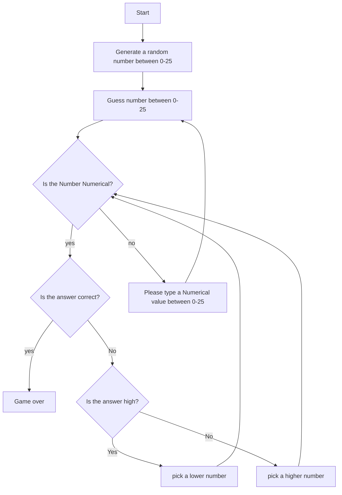

```mermaid
flowchart TD
 A[Start] --> B[Generate a random number between 0-25]
    B --> C[Guess number between 0-25]
    C --> Y{Is the Number Numerical?}
    Y -- yes --> D{Is the answer correct?}
    Y -- no --> H[Please type a Numerical value between 0-25]
    H --> C
    D --  yes -->  F[Game over]
    D -- No --> N{Is the answer high?}
    N-- Yes --> Z[pick a lower number]
    Z --> Y
    N-- No --> X[pick a higher number]
    X --> Y
```